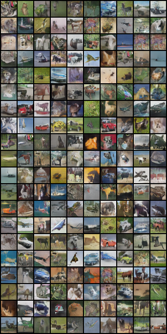

# Generative Adversarial Networks (GAN)

[GAN](https://arxiv.org/abs/1406.2661) is the generative framework where we train 2 parametrized networks. Here is my implementation of [Deep Convolutional GAN](https://arxiv.org/abs/1511.06434) on CIFAR-10 dataset.

To run: `python main.py`

With current setting, the FID score of the presented images below is `0.437`.

Generated images:

