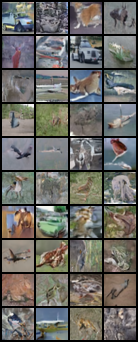
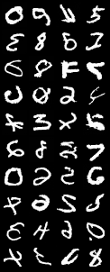

# Denoising Diffusion Probabilistic Models

This folder contains implementation of [DDPM](https://arxiv.org/abs/2006.11239) using the [Annotated Diffusion Tutorial](https://huggingface.co/blog/annotated-diffusion).

The FID score was not computed, however train loss saturated after 20th epoch for both datasets CIFAR10 and MNIST.

> Update 12 Sep 2023: FID score is 0.187 (!)

The hyperparameters for MNIST:
> UNet(dim=32, downsample_w_stride=False, upsample_w_transpose=False, width_factor=(1, 2, 4), in_channels=1)

The hyperparameters for CIFAR10:
> UNet(dim=64, downsample_w_stride=False, upsample_w_transpose=False, width_factor=(1, 2, 4, 8), in_channels=3)

Sampled batch of images from Gaussian noise:

### Some ablations

Learnable positional embedding: `no visual improvement & train loss is the same`

Upsample with transposed convolutions: `no improvement & train loss is the same`

Downsample with strided convolutions: `no improvement & train loss is the same`