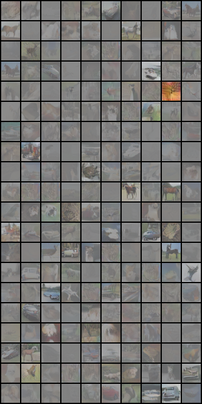
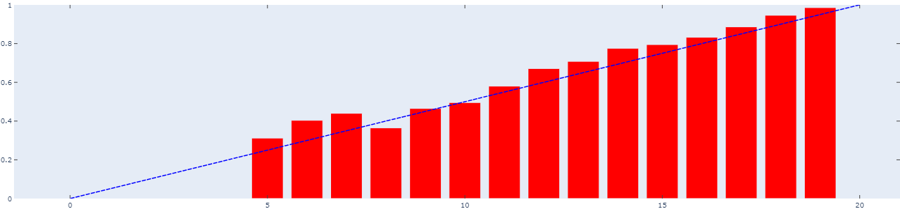

# Joint Energy Models: Classifier and Generator

This folder contains implementation of ["Your Classifier is Secretly an Energy Based Model and You Should Treat it Like One"](https://arxiv.org/abs/1912.03263) paper. The code referenced from [official repo](https://github.com/wgrathwohl/JEM) and [this reproduced repo](https://github.com/divymurli/ML_Reprod_HybridEnergyModels).

To run: `python main.py`

> Note: As it's mentioned in the paper, the training is very unstable and at some point loss might become very large. In this case, the training must be stopped and restarted from the saved checkpoint. When training very first time, I recommend lower learning rate `0.00001` and bigger number of sampling steps `30`. Afterwards, learning rate and SGLD steps can be set to `0.0001` and `20` respectively as it was mentioned in the paper.

> Notes: precision-16 should be turned off.

With this setting I've achieved the FID `0.98` and accuracy of `0.80`

### The visualization of generated samples from buffer: 

> Note: These images are not generated from noise but from saved buffer.

### The clasification analysis:

