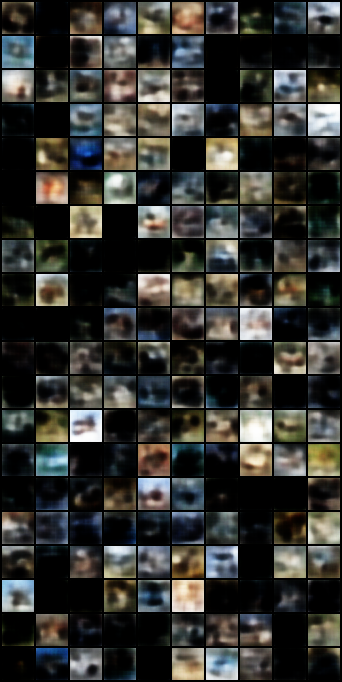
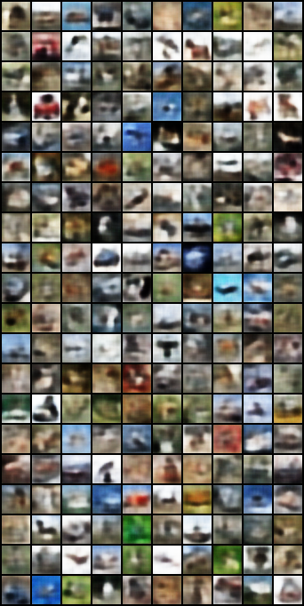

# Variational AutoEncoder

Here I provide the implementation of the Variotional AutoEncoder proposed in the [Auto-Encoding Variational Bayer](https://arxiv.org/abs/1312.6114) paper for CIFAR10 dataset. The architecture's type is CNN.

To run: `python main.py`

With current setting, the lowest FID score is `2.14`. 

> Note: I believe there is a bug in computation of FID as the quality of images are not great.

Samples generated from noise

Reconstucted images

